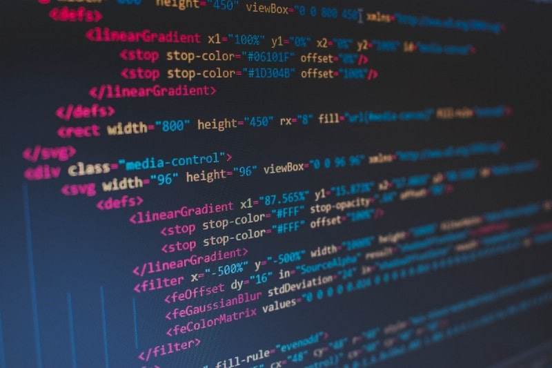

# Web Scraping Projects

## Project 1: NBA Defensive Improvement Recommendation

### Objective:
Identify the worst defensive NBA team from the previous season and provide player recommendations to enhance their defensive performance using business analytics tools and publicly available data.

### Steps:
1. **Team Identification:**
   - Determine the worst defensive NBA team based on available statistics.
   - Recommend players to address defensive weaknesses.

2. **Data Collection:**
   - Utilize Python and web scraping/API tools to gather necessary player statistics from public sources.

3. **Data Pre-processing:**
   - Clean and engineer features using Python to prepare the data for analysis.

4. **Exploratory Data Analysis (EDA):**
   - Generate summary statistics and visualizations to highlight key features relevant to the defensive performance question.

## Project 2: Aldi Job Postings Analysis

### Objective:
Scrape and analyze Aldi's job postings, addressing issues in the initial script, collecting additional relevant data, and performing competitive intelligence analysis.

### Steps:
1. **Issue Identification:**
   - Analyze the existing script for Aldi Head Office position information and identify issues.

2. **Script Revision:**
   - Rewrite the scraping function to overcome identified issues and collect additional data for competitive intelligence.

3. **Data Collection:**
   - Run the revised script, save information as a CSV file, and upload it.

4. **Data Pre-processing:**
   - Perform data cleansing, scaling, normalization, and imputation, explaining each step and decision.

5. **Feature Creation:**
   - Describe and create features that enhance the competitive intelligence analysis of job postings.

6. **Hypothesis Testing:**
   - Formulate and test hypotheses related to job types and salary associations within the dataset.
